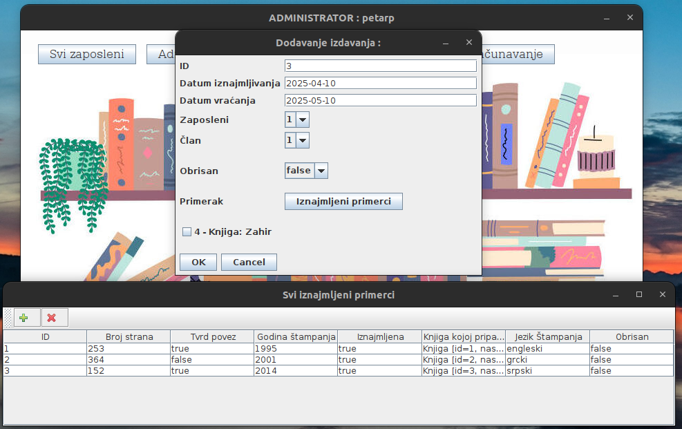
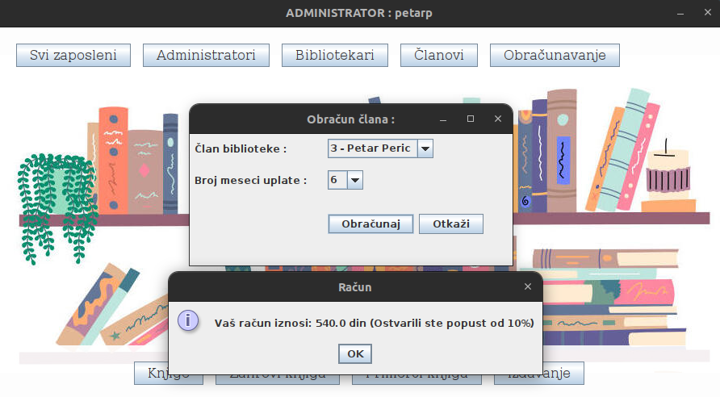

# Library management system
This project is a desktop library management system developed in Java, using Java Swing for the graphical user interface. It aims to support basic functionalities required for everyday library operations, such as managing employees, registering members, maintaining book records, and handling book loans. The architecture is designed following object-oriented principles, and the data is stored in plain text files, with custom methods for file reading and writing.

The system is intended for smaller-scale environments, focusing on clarity, structure, and core logic rather than scalability or advanced persistence mechanisms.

## Library Operation Rules
- Only employees (administrators and librarians) can log in.
- Employee data includes name, surname, JMBG, address, gender, salary, username, and password.
- Administrators can register new employees and add new library members. Librarians can only add new library members.
- Library member data includes name, surname, JMBG, address, gender, membership number, type of membership fee, last payment date, number of months paid, and membership status.
- Monthly membership fees vary by type: 100 dinars for pensioners, 150 dinars for children up to 14 years, and 250 dinars for other members.
- Administrators have access to all entities and actions, while librarians have limited access.
- Book records include title, original title, writer's name, year of publication, language, description, and genre.
- Each book copy is recorded with page number, binding type, year of publication, language, and rental status.
- Individual book rentals include employee processing the rental, renting member, rental date, return date, and rented book copy.
- Library information includes name, address, telephone, and working hours.

## Technical Specification
- Storing data about all entities in text files in any format.
- Manually implemented methods for reading and writing data from/to the files.
- Implemented corresponding enumerations for data with predefined set values (language, binding type).
- Provided unique identifiers (IDs) for each entity, ensuring uniqueness and preventing duplicate entries.
- Implemented logical deletion for entities, keeping their data in files but hiding them from the system.

## Installation and Setup
To run this project locally, follow these steps:

1. Clone the repository:
   git clone repository-url.

2. Launch Eclipse or other environment and open the workspace where project is saved.

3. Set up the database:
Make sure all .txt files for data storage are in place and correctly referenced in the code (set by default).
Ensure that the application has read/write permissions for the .txt files if needed.

4. Add library:
First, create a folder named lib inside the src folder of your project (if it doesn’t already exist).
Then, download the required library files from the following link:
https://drive.google.com/drive/folders/1trxUgmFsU18UgL9BxcZYbF3dIvgoaSoA?usp=sharing
Place all downloaded .jar files into the newly created lib folder.
After that, in your IDE, right-click on each .jar file (or the entire lib folder) and add them as libraries to your project so they are correctly referenced in your code.

6. Run the application:
In Eclipse, locate project in the Package Explorer.
Right-click on main class.
Select Run As > Java Application.

## Images of project

### Login and Register

## Main Page

## All Employees, Library Members, Books, Book Genres, Book Records, Book Rentals

## Create Book Rentals

## Create Employee, Update Employee

## Membership Fee Billing 

